## Interacción y colaboración con el repositorio del curso

#### 01. Descargar e instalar "git"
Descargue GIT desde el [enlace](https://git-scm.com/downloads) oficial e instale con las opciones por defecto. 

#### 02. Verifique que tiene instalado git
Abra la ventana de comandos (cmd, terminal) y verifique que tiene instalado **git** con el comando ```git version```

    
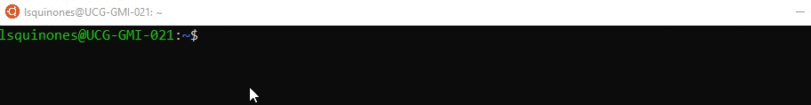

#### 03. Configurar sus datos en git
Registre su nombre y correo que utiliza en su cuenta de github.

      >> git config --global user.name "su_nombre"
      >> git config --global user.email "correo_git"
      
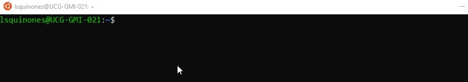
#### 04. Abrir el repositorio original [https://github.com/lsantiago/PythonIntermedio](https://github.com/lsantiago/PythonIntermedio)  y realizar un Fork

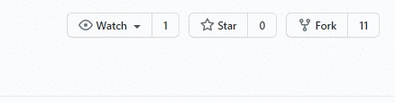

> Un fork significa bifurcación, y en programación supone copiar un proyecto y partir de este,  hacerle modificaciones. Cuando trabajamos con repositorios Git, supone hacer una copia exacta del proyecto, generando dos URL distintas. [1]

#### 05. Clonar repositorio que se genero al realizar el Fork 
Remplace el texto <su_usuario> con su nombre de usuario que utiliza en github. Puede seleccionar la carpeta donde desee descargar su repositorio.
      
      >> git clone https://github.com/<su_usuario>/PythonIntermedio
      
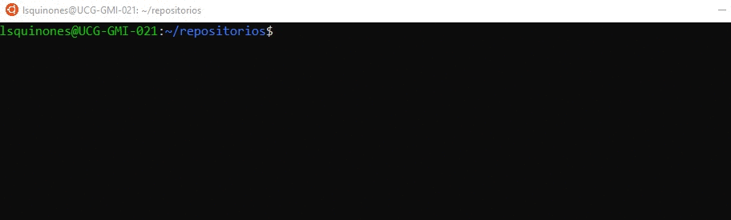
#### 06. Acceder a la carpeta que se genero **"PythonIntermedio"**
      >> cd PythonIntermedio
      
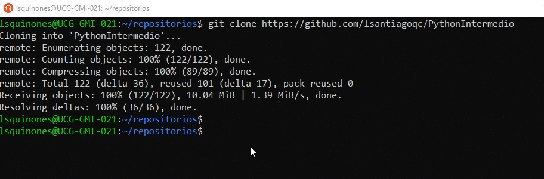
#### 07. Crear branch (rama) para colaborar | resolver problemas | crear nuevas funcionalidades. 

> En el día a día del trabajo con Git una de las cosas útiles que podemos hacer es trabajar con ramas. Las ramas son caminos que puede tomar el desarrollo de un software, algo que ocurre naturalmente para resolver problemas o crear nuevas funcionalidades. En la práctica permiten que nuestro proyecto pueda tener diversos estados y que los desarrolladores sean capaces de pasar de uno a otro de una manera ágil. [2]

      % use el siguiente formato de comando cuando quiera crear y cambiarse a la nueva rama
      git checkout -b <nombre_rama_sin_espacios> 


      >> git checkout -b RegName
      
En este primer ejemplo, el "branch" se lo utilizara para registrar su nombre en el archivo README.md

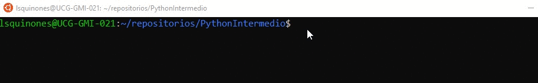

      # con el siguiente comando podrá verificar en que rama se encuentra
      >> git branch -a


#### 08. Modifique el archivo README.md con cualquier editor y registre su datos. 

Formato: Nombre Apellido, URL de github

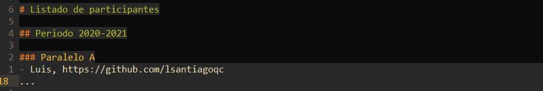

Guarde los cambios en el editor que haya utilizado. 

#### 09. Añadir archivo(s) al área de ensayo
      
En Git los archivos primero se añaden al área de ensayo antes de poder guardarlos en el historial, ya sean nuevos en el proyecto o sean archivos ya existentes pero con nuevas modificaciones. Para ello se escribe el comando:

      >> git add archivo.txt

El archivo ahora estará en el área de ensayo, preparado para formar parte del historial del proyecto.

Si se han hecho cambios en varios archivos, se pueden añadir todos juntos al área de ensayo con el siguiente código:

      >> git add . 

Previo a añadir el archivo puede revisar el estado del repositorio con el comando ```git status```, luego si proceda a añadir los cambios realizado en el archivo README.md

 


#### 10. Confirmar (commit) cambios en repositorio local
      git commit -m <comentario> Ej.
      
      >> git commit -m "Add Name Luis" 

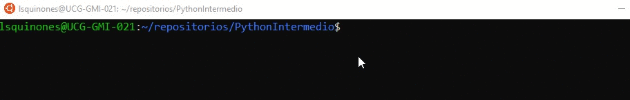

> El comando git commit captura una instantánea de los cambios preparados en ese momento del proyecto. Las instantáneas confirmadas pueden considerarse como versiones "seguras" de un proyecto: Git no las cambiará nunca a no ser que se lo pidas expresamente. [3]

#### 11. Llevar cambios a servidor remoto
      git push <nombre_servidor> <nombre_rama> Ej.

      >> git push origin **RegName**

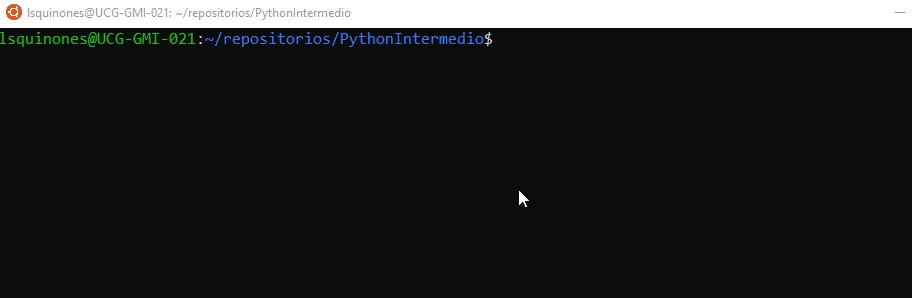

El comando git push se usa para cargar contenido del repositorio local a un repositorio remoto.

#### 12. Realizar pull request (en git hub), de su servidor remoto "Fork" al servidor original 

Al momento de realizar el pull reques verifique de que este seleccionado la rama que genero, y que desea enviar los cambios al servidor original.

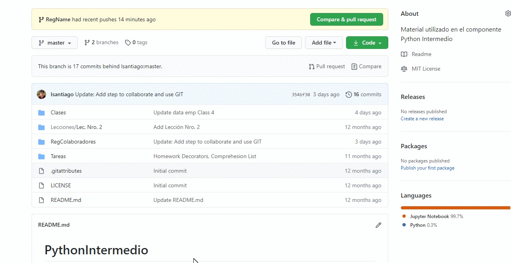

> Cuando un desarrollador termina de crear (y probar) ya sea una nueva funcionalidad o corrección de bug, solicita integrar su desarrollo al repositorio principal. [4]

 

*La siguiente acción sólo la realiza el revisor del repositorio original.*

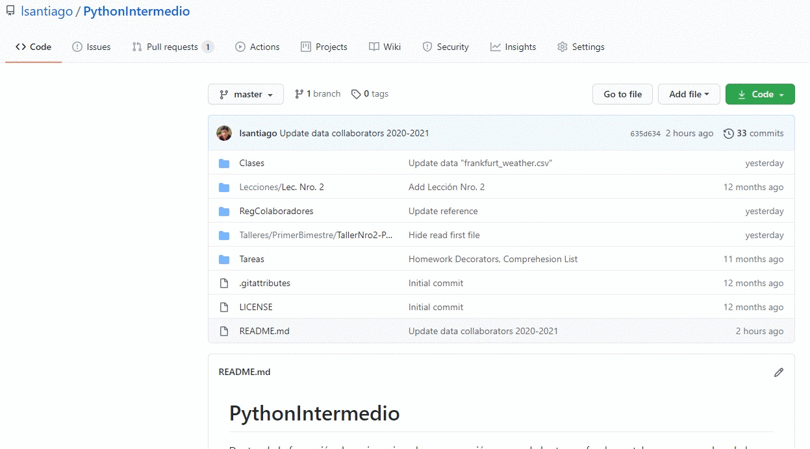

**Importante:** En el momento que el revisor del repositorio original acepte su cambio le llegara a su correo una notificación de aceptación o de revisión.

#### 13. Traer nuevos cambios desde servidor original

Una vez que configure el acceso al servidor original con los comando que se detalla a continuación es recomendable que ejecute de forma regular el comando ```git pull upstream <nombre de rama>``` para tener actualizado el repositorio local.   

       # Regresa a la rama principal
       git checkout master
       
       # Lista y agrega el servidor remoto original (sólo una vez)
       git remote -v
       git remote add upstream https://github.com/lsantiago/PythonIntermedio
       git remote -v

       % trae los ultimos cambios desde el servidor original (realizar de forma regular)
       git pull upstream master

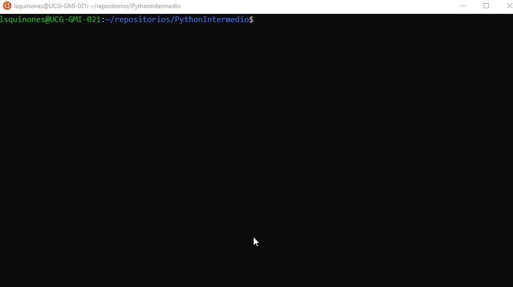

**Importante:** Para cambiarse entre ramas solo debe escribir ```git checkout <nombre de rama>```. Sin el comodin -b.

---
Para nuevas colaboraciones repetir los paso del 7 al 12.

---

## Durante clases

En cada clase se recomienda seguir los siguientes pasos
 
#### Descargue los ultimos cambios del repositorio original
      git pull upstream master

#### Genere nueva rama por cada clase. Ej.
      git checkout -b ClaseNro5


---
## Referencias
* [1] Bifurcar un repositorio - GitHub Docs. (2020). Retrieved 14 November 2020, from https://docs.github.com/es/free-pro-team@latest/github/getting-started-with-github/fork-a-repo
* [2] Trabajar con ramas en Git: git branch. (2020). Retrieved 14 November 2020, from https://desarrolloweb.com/articulos/trabajar-ramas-git.html
* [3] git commit | Atlassian Git Tutorial. (2020). Retrieved 14 November 2020, from https://www.atlassian.com/es/git/tutorials/saving-changes/git-commit#:~:text=El%20comando%20git%20commit%20captura,que%20se%20lo%20pidas%20expresamente.
* [4] ¿Qué son los pull requests y por qué valen la pena?. (2019). Retrieved 14 November 2020, from https://blog.nearsoftjobs.com/qu%C3%A9-son-los-pull-requests-y-por-qu%C3%A9-valen-la-pena-ed98d19d124e

## Recursos adicionales
#### Colaborar en repositorios públicos 
Aplica a los pasos antes descritos. 
- https://www.youtube.com/watch?v=xl3nxfbGkzY&ab_channel=Danieldelfuturo


#### Para trabajar en su propio repositorio
- https://youtu.be/kEPF-MWGq1w
- https://youtu.be/7-JHoPyJy-Q
- https://youtu.be/lNBFt733izY [HERRAMIENTA GRÁFICA]